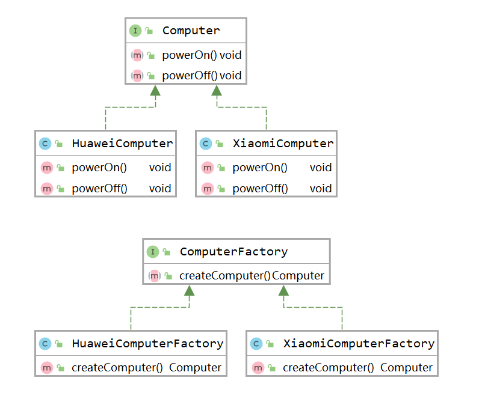
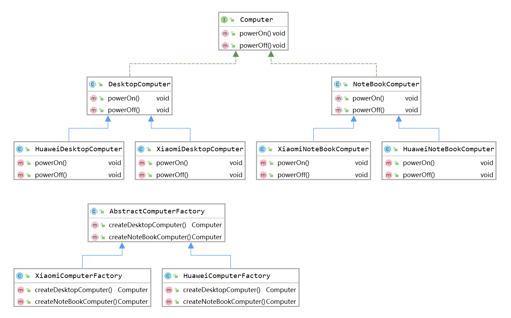
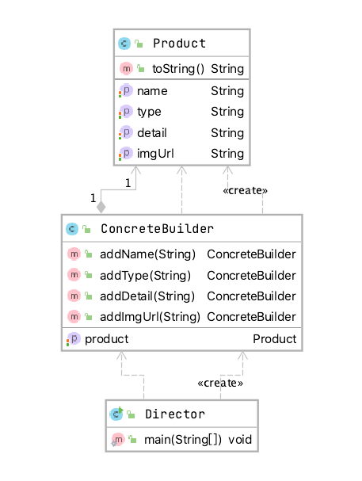
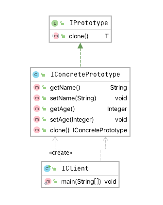
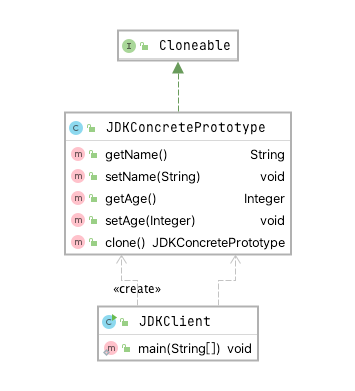

# 设计模式

## 一、软件设计原则

​		主要有七大设计原则，分别是开闭原则、依赖倒置原则、单一职责原则、接口隔离原则、迪米特法则、里式替换原则、合成复用原则。

### 1.1 开闭原则（OCP）

​		开闭原则（Open-Closed Principle，OCP）是指一个软件实体类、模块和函数应该对扩展开放，对修改关闭。强调的是抽象构建框架 ，用实现扩展细节，可以提高软件的可复用性及维护性。例如：我们版本更新，尽可能不修改源码，但可以增加新功能。

**总结：**

> 1、对扩展开放，对修改关闭
>
> 2、核心思想是面向抽象编程


### 1.2 依赖倒置原则（DIP）

​		依赖倒置原则（Dependence Inversion Principle，DIP）是指设计代码结构时，高层模块不应该依赖底层模块，二者都应该依赖其抽象。抽象不应该依赖细节，细节应该依赖抽象。通过依赖倒置，可以减少类与类之间的耦合性，提高系统的稳定性，提高代码的可读性和可维护性，并能够降低修改程序所造成的的风险。

**总结：**

> 1、高层模块不应该依赖底层模块，二者都应该依赖其抽象
>
> 2、抽象不应该依赖细节，细节应该依赖抽象


### 1.3 单一职责原则（SRP）

​		单一职责（Simple Responsibility Principle，SRP）是指不要存在多于一个导致类变更的原因。假设我们有一个Class负责两个职责，一旦发生需求变更，修改其中一个职责的逻辑代码，有可能会导致另一个职责的功能发生故障。这样一来，这个Class存在两个导致变更的原因。如何解决这个问题呢？我们就要给两个职责分别用两个Class来实现，进行解耦。后期需求变更维护互不影响，这样的设计可以降低类的复杂度，提高类的可读性，提高系统的可维护性，降低变更引起的风险。总体来说就是一个Class/Interface/Method负责一项职责。

**总结：**

> 一个Class/Interface/Method负责一项职责


### 1.4 接口隔离原则（ISP）

​		接口隔离原则（Interface Segregation Principle，ISP）是指用多个专门的接口，而不是使用单一的总接口，客户端不应该依赖他不需要的接口。这个原则指导我们在设计接口时应当注意以下几点：

​		1、一个类对一个类的依赖应该建立在最小的接口之上。

​		2、建立单一接口，不要建立庞大臃肿的接口。

​		3、尽量细化接口，接口中的方法尽量少（不是越少越好，一定要适度）。

​		接口隔离原则符合我们常说的高内聚低耦合的设计思想，从而使得类具有很好的可读性、可扩展性和可维护性。

**总结：**

> 1、一个类对一个类的依赖应该建立在最小的接口之上。
>
> 2、建立单一接口，不要建立庞大臃肿的接口。
>
> 3、尽量细化接口，接口中的方法尽量少（不是越少越好，一定要适度）。


### 1.5 迪米特法则（LOD）

​		迪米特法则（Law Of Demeter，LOD）是指一个对象应该对其他对象保持最少的了解，又叫最少知道原则，尽量降低类与类之间的耦合 。迪米特原则主要强调只和 朋友交流，不和陌生人说话。出现在成员变量、方法的输入、输出参数中的类都可以称为成员朋友类。

**总结：**

> 1、最少知道原则
>
> 2、一个对象应该对其他对象保持最少的了解


### 1.6 里式替换原则（LSP）

​		里式替换原则（Liskov Substitution Principle，LSP）是指一个软件实体如果适用一个父类的话，那一定适用于其子类，所有引用父类的地方必须能透明的使用其子类的对象，子类对象能够替换父类对象，而程序逻辑不变。

**总结：**

> 子类可以扩展父类的功能，但不能改变父类原有的功能，为了约束继承泛滥，开闭原则的一种体现。


### 1.7 合成复用原则（）

合成复用原则（Composite/Aggregate Reuse Principle，CARP）是指尽量使用对象组合（has-a）/ 聚合（contains-a），而不是继承关系达到软件复用的目的。可以使系统更加灵活，降低类与类之间的耦合度，一个类的变化对其他类造成的影响相对较少。

**总结：**

> 1、尽量使用对象组合（has-a）/ 聚合（contains-a）
>
> 2、继承称为白箱复用，把所有的实现细节暴露给子类。
>
> 3、组合/聚合称为黑箱复用，对类以外的对象无法获取到实现细节。


## 二、设计模式

### 2.1 创建型模式（Creational Pattern）

​		创建型模式包含：单例模式、抽象工厂模式、工厂方法模式、建造者模式、原型模式。

#### 2.1.1 单例模式

​		单例模式(Singleton Pattern)： 保证一个类仅有一个实例，并提供一个访问它的全局访问点。

（1）饿汉式（静态常量）

```java
/**
 * 饿汉式（静态常量）
 */
public class Singleton1 {
    private final static Singleton1 INSTANCE = new Singleton1();
    private Singleton1() {
    }
    public static Singleton1 getInstance(){
        return INSTANCE;
    }
}
```

（2）饿汉式（静态代码块）

```java
/**
 * 饿汉式（静态代码块）（可用）
 */
public class Singleton2 {
    private final static Singleton2 INSTANCE;
    static{
        INSTANCE = new Singleton2();
    }
    private Singleton2() {
    }
    public static Singleton2 getInstance(){
        return INSTANCE;
    }
}
```

（3）懒汉式（线程不安全）

```java
/**
 * 懒汉式（线程不安全）
 */
public class Singleton3 {
    private static Singleton3 INSTANCE;
    private Singleton3() {
    }

    public static Singleton3 getInstance(){
        if(INSTANCE == null){
            INSTANCE = new Singleton3();
        }
        return INSTANCE;
    }
}
```

（4）懒汉式（线程安全）（可用，不推荐，效率太低）

```java
/**
 * 懒汉式（线程安全）（可用，不推荐，效率太低）
 */
public class Singleton4 {
    private static Singleton4 INSTANCE;
    private Singleton4() {
    }
    public synchronized static Singleton4 getInstance(){
        if(INSTANCE == null){
            INSTANCE = new Singleton4();
        }
        return INSTANCE;
    }
}
```

（5）懒汉式（线程不安全）（不推荐）

```java
/**
 * 懒汉式（线程不安全）（不推荐）
 * 多个线程同时进入 if(INSTANCE == null){里就会出现多次创建实例
 */
public class Singleton5 {
    private static Singleton5 INSTANCE;
    private Singleton5() {
    }

    public static Singleton5 getInstance(){
        if(INSTANCE == null){
            synchronized (Singleton5.class){
                INSTANCE = new Singleton5();
            }
        }
        return INSTANCE;
    }
}
```

（6）双重检查（**推荐面试使用**）

```java
/**
 * **双重检查（推荐面试使用）
 */
public class Singleton6 {
    private volatile static Singleton6 INSTANCE;
    private Singleton6() {
    }

    public static Singleton6 getInstance(){
        if(INSTANCE == null){
            synchronized (Singleton6.class){
                if(INSTANCE == null){
                    INSTANCE = new Singleton6();
                }
            }
        }
        return INSTANCE;
    }
}
```

（7）静态内部内方式（可用）

```java
/**
 * 静态内部内方式（可用）
 */
public class Singleton7 {
    private Singleton7() {
    }
    public static Singleton7 getInstance(){
        return SingletonInstance.INSTANCE;
    }

    //这个内部类和里面的INSTANCE都是静态的，JVM类加载时就保证了唯一性
    private static class SingletonInstance {
        private static final Singleton7 INSTANCE = new Singleton7();
    }
}
```

（8）枚举单例（可用）属于懒加载

```java
/**
 * **枚举单例（可用）属于懒加载
 */
public enum Singleton8 {
    INSTANCE{
        protected void printTest(){
            System.out.println("print test");
        }
    };
    protected abstract void printTest();
    private Object data;

    public Object getData() {
        return data;
    }

    public void setData(Object data) {
        this.data = data;
    }

    public static Singleton8 getInstance(){
        return INSTANCE;
    }
}
```

#### 2.1.2 工厂方法模式

​		工厂方法模式(Factory Method Pattern)：定义一个用于创建对象的接口，让子类决定将哪一个类实例化。Factory Method使一个类的实例化延伸到其子类。在工厂方法模式中用户只需要关心所需产品对应的工厂，无须关心创建细节，而且加入新的产品符合开闭原则。


​		

#### 2.1.3 抽象工厂模式

​		抽象工厂模式(Abstract Factory Pattern)：提供一个创建一系列相关或相互依赖对象的接口，而无需指定它们具体的类。

> 产品族： 位于不同产品等级结构中，功能相关联的产品组成的家族。

使用抽象工厂模式的条件：

1. 系统中有多个产品族，而系统一次只可能消费其中一族产品。
2. 同属于同一个产品族的产品以其使用




#### 2.1.4 建造者模式

​		建造者模式(Builder Pattern)：将一个复杂对象的构建与它的表示分离，使得同样的构建过程可以创建不同的表示。

建造者模式的设计中主要有四个角色：

> 1、产品（Product）：要创建的产品类对象
>
> 2、建造者抽象（Builder）：建造者的抽象类，规范产品对象的各个组成部分的构建，一般由子类实现具体的建造过程。
>
> 3、建造者（ConcreteBuilder）：具体Builder类，根据不同的业务逻辑，具体化对象的各个组成部分创建。
>
> 4、调用者（Director）：调用具体的建造者，来创建对象的各个部分。在指导者中不涉及具体产品的信息，只负责保证对象各部分完整创建或按某种顺序创建。

应用场景：mybatis逆向工程生成的查询Example



#### 2.1.5 原型模式

​		原型模式(Prototype Pattern)：用原型实例指定创建对象的种类，并且通过拷贝这个原型来创建新的对象。

​		原型模式的核心在于拷贝原型对象，以系统中已存在的一个对象为原型，直接基于内存二进制流进行拷贝，无需再经历耗时的对象初始化过程（不调用构造函数），性能提升许多。

原型模式主要包含三个角色：

> 客户（Client）：客户类提出创建对象的请求。
>
> 抽象原型（Prototype ）：规定拷贝接口。
>
> 具体原型（Concrete Prototype ）：被拷贝的对象。

按照通常的原型模式的写法，其实我们依旧要在clone()方法中进行new对象和set复制，这里的工作量依旧很大。



JDK已经帮我们实现了一个现成的API，我们只需要实现Cloneable接口即可。



但是当我们添加一个爱好List集合时，克隆的对象爱好属性新增内容，原型对象的爱好属性也发生了改变，这显然不符合预期，克隆出来的对象应该和原型对象不再有联系才对。JDK的Cloneable采用的是浅克隆，只是完整的复制了值类型数据，没有赋值引用对象。

使用序列化实现深度克隆，重写clone()方法或者我们新一个deepClone的方法，去实现深克隆。

```java
public DeepCloneConcretePrototype deepClone(){
  try{
    ByteArrayOutputStream bos = new ByteArrayOutputStream();
    ObjectOutputStream oos = new ObjectOutputStream(bos);
    oos.writeObject(this);

    ByteArrayInputStream bis = new ByteArrayInputStream(bos.toByteArray());
    ObjectInputStream ois = new ObjectInputStream(bis);

    return (DeepCloneConcretePrototype) ois.readObject();

  }catch (Exception e){
    e.printStackTrace();
    return null;
  }
}
```

如果我们克隆的目标的对象是单例对象，那意味着，深克隆就会破坏单例。

解决办法：

> 1、单例类不实现Cloneable接口；
>
> 2、或者重写clone方法，在clone方法中返回单例对象即可


### 2.2 结构型模式（Structural Pattern）

​		结构型模式包含：适配器模式、装饰器模式、代理模式、外观模式、桥接模式、组合模式、享元模式。

#### 2.2.1 适配器模式

​		适配器模式(Adapter Pattern)： 将一个类的接口转换成客户希望的另外一个接口。Adapter模式使得原本由于接口不兼容而不能一起工作的那些类可以一起工作。

#### 2.2.2 装饰器模式

​		装饰器模式(Decorator Pattern)： 动态地给一个对象添加一些额外的职责。就扩展功能而言，它比生成子类方式更为灵活。

#### 2.2.3 代理模式

​		代理模式(Proxy Pattern):为其他对象提供一个代理以控制对这个对象的访问。

#### 2.2.4 外观模式

​		外观模式(Facade Pattern)：为子系统中的一组接口提供一个一致的界面，Facade模式定义了一个高层接口，这个接口使得这一子系统更加容易使用。

#### 2.2.5 桥接模式

​		桥接模式(Bridge Pattern)：将抽象部分与它的实现部分分离，使它们都可以独立地变化。

#### 2.2.6 组合模式

​		组合模式(Composite Pattern)：将对象组合成树形结构以表示“部分-整体”的层次结构。它使得客户对单个对象和复合对象的使用具有一致性。

#### 2.2.7 享元模式

​		享元模式(Flyweight Pattern)：运用共享技术有效地支持大量细粒度的对象。


### 2.3 行为型模式（Behavioral Pattern）

​		行为型模式包含：策略模式、模板方法模式、观察者模式、迭代子模式、责任链模式、命令模式、备忘录模式、 状态模式、访问者模式、中介者模式、解释器模式。

#### 2.3.1 策略模式

​		策略模式(Strategy Pattern)： 定义一系列的算法，把它们一个个封装起来，并且使它们可相互替换。本模式使得算法的变化可独立于使用它的客户。

#### 2.3.2 模板方法模式

​		模板方法模式(Template Method Pattern)： 定义一个操作中的算法的骨架，而将一些步骤延迟到子类中。Template Method使得子类可以不改变一个算法的结构即可重定义该算法的某些特定步骤。

#### 2.3.3 观察者模式

​		观察者模式(Observer Pattern)：定义对象间的一种一对多的依赖关系,以便当一个对象的状态发生改变时,所有依赖于它的对象都得到通知并自动刷新。

#### 2.3.4 迭代器模式

​		迭代器模式(Iterator Pattern)：提供一种方法顺序访问一个聚合对象中各个元素, 而又不需暴露该对象的内部表示。

#### 2.3.5 责任链模式

​		责任链模式(Chain of Responsibility Pattern)：为解除请求的发送者和接收者之间耦合，而使多个对象都有机会处理这个请求。将这些对象连成一条链，并沿着这条链传递该请求，直到有一个对象处理它。

#### 2.3.6 命令模式

​		命令模式(Command Pattern)：将一个请求封装为一个对象，从而使你可用不同的请求对客户进行参数化；对请求排队或记录请求日志，以及支持可取消的操作。

#### 2.3.7 备忘录模式

​		备忘录模式(Memento Pattern)：在不破坏封装性的前提下，捕获一个对象的内部状态，并在该对象之外保存这个状态。这样以后就可将该对象恢复到保存的状态。

#### 2.3.8 状态模式

​		状态模式(State Pattern)：允许一个对象在其内部状态改变时改变它的行为。对象看起来似乎修改了它所属的类。

#### 2.3.9 访问者模式

​		访问者模式(Visitor Pattern)：表示一个作用于某对象结构中的各元素的操作。它使你可以在不改变各元素的类的前提下定义作用于这些元素的新操作。

#### 2.3.10 中介者模式

​		中介者模式(Mediator Pattern)：用一个中介对象来封装一系列的对象交互。中介者使各对象不需要显式地相互引用，从而使其耦合松散，而且可以独立地改变它们之间的交互。

#### 2.3.11 解释器模式

​		解释器模式(Interpreter Pattern)：给定一个语言，定义它的文法的一种表示，并定义一个解释器, 该解释器使用该表示来解释语言中的句子。
